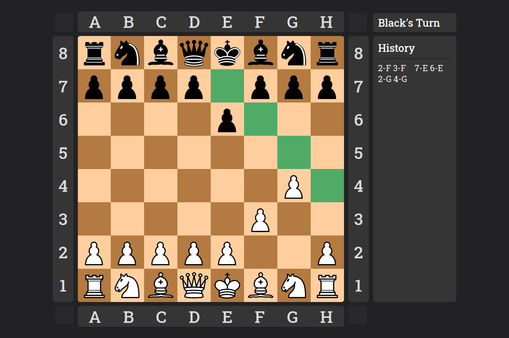

# Chess

## About

Chess. Made by me. I've written it in HTML, SCSS and vanilla JavaScript. I've used Webpack to compile SCSS and JS into one file.
For now you can only play against yourself, and few rules are not implemented yet.



## Installation
```
git clone https://github.com/kolaczyn/chess-js.git
cd chess-js
npm install
npm run build
# You can now open index.html in a browser
```

## Todo
- Castling
- Pawn promotion
- Restarting game
- En passant
- Resigning
- Draw
- Browse history
- Fix history when there are too many elements
- More responsive
- Menu
- AI
- Let two random people play against each other
